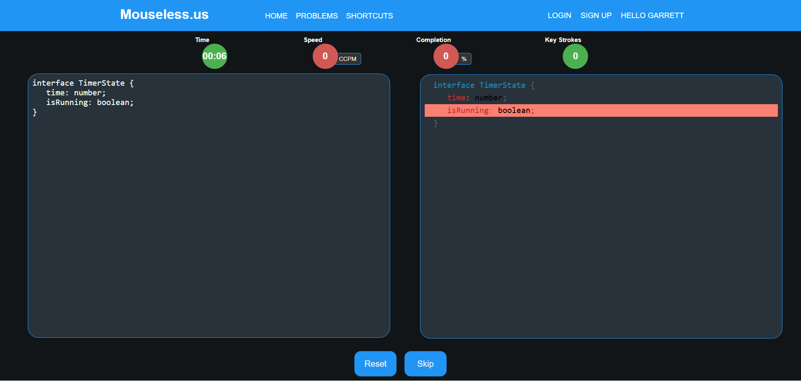

# Mouseless.us

## How to run
In order to run the project you simply need to install the required dependencies.
`npm install`

Then start the program.
`npm start`

*This project is still in progress.*

As a developer, speed and efficiency are critical when working with code. Traditional typing practice tools focus on raw words-per-minute, but coding requires a different approach—one that emphasizes keybindings, syntax manipulation, and precision. That’s where **Mouseless** comes in.

## What is Mouseless?
**Mouseless** is a web-based typing practice platform designed specifically for developers. Unlike standard typing tests, it presents users with real code snippets and requires them to modify the code to match a given output. This approach helps reinforce essential developer skills, including:

- Mastering **keybindings** for rapid navigation and editing
- Efficiently manipulating code **without relying on a mouse**
- Improving **speed** and **accuracy** in a real-world coding environment

## Technology Stack
Mouseless is built with scalability and performance in mind, leveraging a modern, efficient stack:

- **Frontend**: A **React** application providing a dynamic, responsive interface
- **Backend**: A **Django API** handling business logic and data management
- **Database**: **PostgreSQL** for handling most requests, ensuring robust data storage
- **Caching**: **Redis** for session ID validation, optimizing authentication performance

This architecture allows the system to scale efficiently, handling high user traffic without performance degradation.

## Tracking Progress with Real Data
Mouseless doesn’t just provide exercises—it also tracks detailed performance statistics over time. Users can view:

- **Personal improvement trends** based on speed and accuracy
- **Community-wide averages** for meaningful comparisons
- **Historical data** to measure long-term progress

This analytical approach gives users clear insights into their efficiency gains and helps them refine their workflow.

## Custom Authentication System
Rather than relying on third-party authentication services, I implemented a **custom authentication system** using **password hashing**, **salting**, and **session-based authentication**. This approach ensures security while integrating seamlessly with the session ID system backed by Redis.
